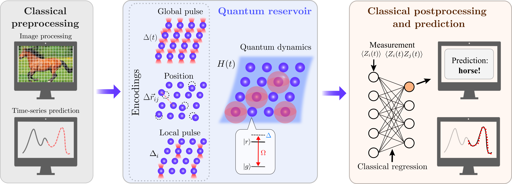

# QRC tutorials
 A set of tutorials for quantum reservoir learning. The tutorials reproduce proof-of-concept simulations and experiments from QuEra's [Large-scale quantum reservoir learning with an analog quantum computer paper](https://arxiv.org/abs/2407.02553). The tutorials are built on [Bloqade.jl](https://github.com/QuEraComputing/Bloqade.jl) and [Bloqade](https://github.com/QuEraComputing/bloqade-python) neutral atom quantum computing SDKs.

 The starting point of the tutorial are a proof-of-concept simulations based on [Bloqade.jl](https://github.com/QuEraComputing/Bloqade.jl), `QRC Demo MNIST.ipynb`. The notebook covers the basic quantum reservoir learning pipeline on an MNIST dataset example. The starting notebook introduces local detuning encoding, the choice of Hamiltonian parameter regime, and comparison with classical neural nets.

 The tutorial on the simulation side is supplemented by two additional julia notebooks. `Classical Spin Reservoir Demo.ipynb` implements the classical spin reservoir on the MNIST data dervied from the quantum reservoir in the infinite (classical) spin limit and used extensively for comparisons in the paper. `QRC Demo Timeseries.ipynb` applies the quantum reservoir learning pipeline on the Santa Fe laser timeseries prediction task and introduces global pulse encoding along the way.

 The second major part of the tutorial, `QRC Demo Aquila Submission.ipynb`, covers the simulations and experimental task submission to QuEra's Aquila based on [Bloqade](https://github.com/QuEraComputing/bloqade-python). The notebook follows the same quantum reservoir learning pipeline for MNIST dataset as in `QRC Demo MNIST.ipynb`, but adds the changes needed for efficient job submission through our python SDK, as well as direct data analysis with standard python machine learning SDKs.

 You will also find a `requirements.txt` file which lets you install the necessary Python dependencies required to run the `QRC Demo Aquila Submission.ipynb` notebook as well as a `Project.toml` that has the Julia dependencies for the `QRC Demo MNIST.ipynb` notebook.

  
  Overview of the quantum reservoir computing algorithm with QuEra's Aquila, from [Large-scale quantum reservoir learning with an analog quantum computer paper](https://arxiv.org/abs/2407.02553).  The QRC algorithm pipeline contains three steps -- classical preprocessing (left), quantum reservoir (center), and classical postprocessing and prediction (right). In the preprocessing step, data features are brought into a form readily encoded to the neutral-atom analog quantum computer. They may require optional dimensional reduction for high-dimensional data (such as images, top) or feature engineering and selection (such as data windowing for timeseries, bottom). The encoding of the data features proceeds by three methods, i.e, encoding into the time profile of the global detuning pulse, the interaction strengths by atom position modulation, and the local pattern of the detuning pulse. The quantum system serving as the reservoir is then evolved over varying time periods and probed through repeated projective measurements. In the third step, the measurement outputs are processed classically to provide expectation values of local observables that form a set of QRC embeddings. The embeddings are subsequently used as inputs to a simple and fast classical training step, for which we typically employ linear support vector machines or regression. The trained models are tested and used for inference by processing additional data through the QRC pipeline and evaluating classical outputs based on obtained embeddings.
